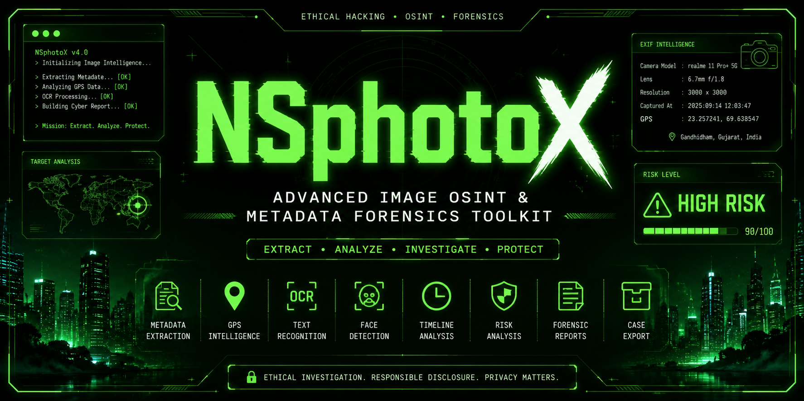
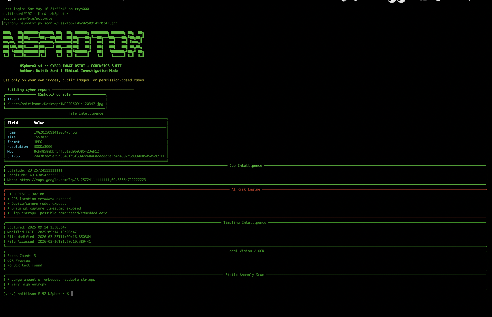
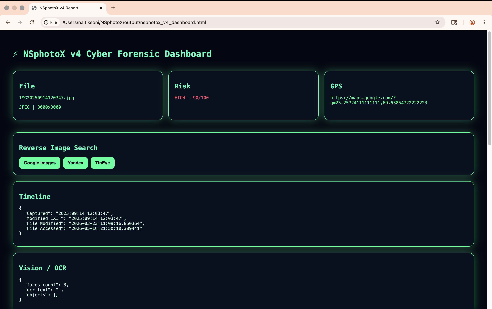
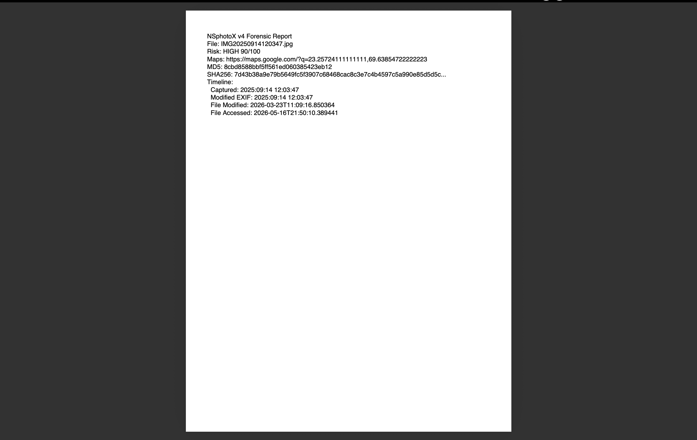

# NSphotoX ⚡
### Advanced Image OSINT & Metadata Forensics Toolkit

<p align="center">
  
</p>

<p align="center">
  <b>Cyberpunk-themed Image OSINT toolkit for ethical cybersecurity research, privacy analysis, and digital forensics learning.</b>
</p>

<p align="center">
  
  
  
  
</p>

---

# 🔍 Overview

NSphotoX is an advanced image OSINT and metadata forensics toolkit built with Python.

It is designed for ethical cybersecurity research, digital investigations, privacy awareness, forensic learning, and image intelligence workflows.

The toolkit extracts EXIF metadata, GPS coordinates, OCR text, timeline information, anomaly indicators, cryptographic hashes, and privacy exposure risks from images.

NSphotoX can generate cyberpunk-style forensic dashboards and investigation reports in HTML, JSON, PDF, ZIP, and CSV formats.

---

# ✨ Features

- 🔎 EXIF metadata extraction
- 🌍 GPS intelligence with Google Maps links
- 🧠 AI-style privacy exposure analysis
- 🔐 MD5 / SHA1 / SHA256 hashing
- 🧾 OCR text extraction
- 👁️ Local face-count analysis
- 🕒 Timeline intelligence
- 🧬 Static anomaly detection
- 🖼️ Reverse image search shortcuts
- 📊 Interactive HTML forensic dashboard
- 📄 PDF forensic report export
- 🧩 JSON report export
- 📦 ZIP forensic case package
- 🧹 Metadata-free clean image export
- 📁 Batch folder investigation mode
- 🖼️ Multi-format image support

---

# 📸 Screenshots

## Terminal Scan



---

## Cyberpunk HTML Dashboard



---

## PDF / Report Output



---

# ⚙️ Installation

# 🧪 Quick Start Guide

Follow the steps below to setup and run NSphotoX on your system.

---

````md
# 🧪 Quick Start Guide

Follow the steps below to setup and run NSphotoX on your system.

---

## 1️⃣ Clone Repository

```bash
git clone https://github.com/NaitikSoni1417/NSphotoX.git
cd NSphotoX
````

---

## 2️⃣ Create Virtual Environment

```bash
python3 -m venv venv
```

---

## 3️⃣ Activate Virtual Environment

### macOS / Linux

```bash
source venv/bin/activate
```

### Windows

```bash
venv\Scripts\activate
```

---

## 4️⃣ Install Python Dependencies

```bash
pip install -r requirements.txt
```

---

## 5️⃣ Install OCR Engine

### macOS

```bash
brew install tesseract
```

### Ubuntu / Debian

```bash
sudo apt install tesseract-ocr
```

---

# ⚡ Running NSphotoX

---

## 🔎 Full Forensic Scan

Analyze metadata, hashes, OCR, GPS, timeline, and anomalies.

```bash
python3 nsphotox.py scan image.jpg
```

---

## 🌍 Extract GPS Coordinates

```bash
python3 nsphotox.py gps image.jpg
```

---

## 🗺️ Open GPS Coordinates in Google Maps

```bash
python3 nsphotox.py gps image.jpg --open
```

---

## 📊 Generate Cyberpunk HTML Dashboard

```bash
python3 nsphotox.py html image.jpg
```

Open dashboard:

```bash
open output/nsphotox_v4_dashboard.html
```

---

## 🧩 Generate JSON Forensic Report

```bash
python3 nsphotox.py json image.jpg
```

---

## 📄 Generate PDF Investigation Report

```bash
python3 nsphotox.py pdf image.jpg
```

---

## 📦 Generate ZIP Case Package

```bash
python3 nsphotox.py zip image.jpg
```

---

## 🧹 Create Metadata-Free Clean Image

```bash
python3 nsphotox.py clean image.jpg
```

---

## 📁 Batch Folder Investigation

Analyze all images inside a folder.

```bash
python3 nsphotox.py batch ./photos
```

---

# 🖼️ Example Using Full Image Path

```bash
python3 nsphotox.py scan /Users/username/Desktop/photo.jpg
```

```bash
python3 nsphotox.py html /Users/username/Desktop/photo.jpg
```

```bash
python3 nsphotox.py gps /Users/username/Desktop/photo.jpg --open
```

---

# 📂 Output Files

All generated reports are saved inside the `output/` folder.

Open output folder:

```bash
open output
```

Common output files:

```text
nsphotox_v4_dashboard.html
nsphotox_v4_report.json
nsphotox_v4_report.pdf
nsphotox_case_package.zip
batch_report.csv
clean_image.jpg
```

---

# 🛠️ Useful Development Commands

## Install new dependencies

```bash
pip install package-name
```

---

## Update requirements.txt

```bash
pip freeze > requirements.txt
```

---

## Push updates to GitHub

```bash
git add .
git commit -m "Update project"
git push
```

---

## Check installed Python packages

```bash
pip list
```

---

## Open current project folder

```bash
open .
```

---

# 🛑 Exit Virtual Environment

```bash
deactivate
```

---

# ⚠️ Troubleshooting

## "ModuleNotFoundError"

Activate virtual environment first:

```bash
source venv/bin/activate
```

---

## "FileNotFoundError"

Use the correct image path:

```bash
python3 nsphotox.py ~/Desktop/photo.jpg
```

---

## OCR Not Working

Install Tesseract:

```bash
brew install tesseract
```

---

# 🚀 Recommended Workflow

```bash
source venv/bin/activate

python3 nsphotox.py scan image.jpg

python3 nsphotox.py html image.jpg

open output/nsphotox_v4_dashboard.html
```

---

# 🔥 NSphotoX Workflow

```text
Image → Metadata Extraction → Risk Analysis → GPS Intelligence →
OCR Analysis → Timeline Reconstruction → Dashboard Generation →
Forensic Report Export
```
 #   👨‍💻 Author

 Developed by Naitik Soni

GitHub: https://github.com/NaitikSoni1417
email:  naitik.infosec@gmail.com

#    ⭐ Support

If you like this project, consider giving it a star on GitHub.

NSphotoX — Ethical Image Intelligence Made Powerful.


